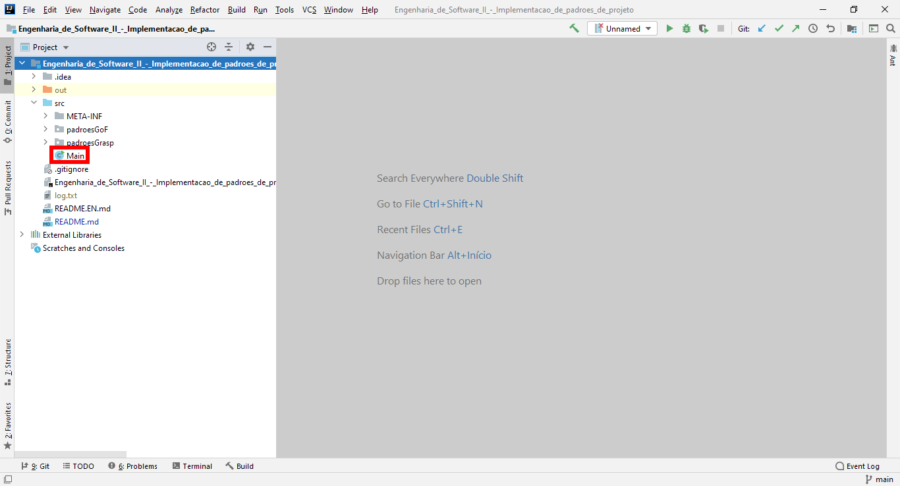
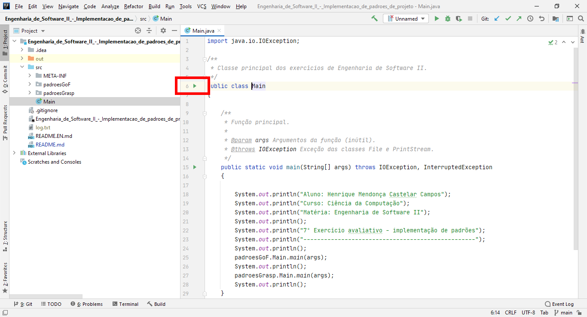
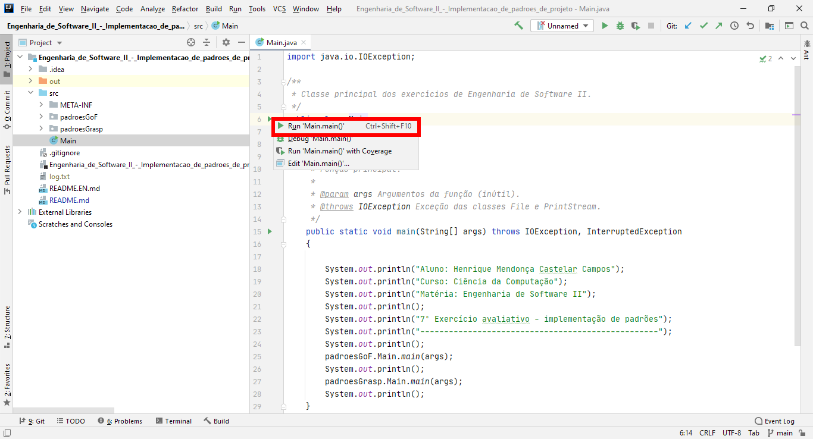

[Versão em Português](README.md)

# 7th Evaluation exercise - implementation of design patterns - Software Engineering II

This repository contains the source code files developed in the list of exercises in the subject of Software Engineering II of the Computer Science course at the Pontifical Catholic University of Minas Gerais.

## Exercises

### Design Patterns GoF – implementation

#### Exercise 1

[Task](src/padroesGoF/exercicioUm/Enunciado.EN.md)

[Answer](src/padroesGoF/exercicioUm)

#### Exercise 2

[Task](src/padroesGoF/exercicioDois/Enunciado.EN.md)

[Answer](src/padroesGoF/exercicioDois/Resposta.EN.md)

#### Exercise 3

[Task](src/padroesGoF/exercicioTres/Enunciado.EN.md)

[Answer](src/padroesGoF/exercicioTres)

### Design Patterns GRASP – Implementation

#### Block of Questions A

[Task](src/padroesGrasp/a/Enunciado.EN.md)

##### Question A.1

[Task](src/padroesGrasp/a/questaoUm/Enunciado.EN.md)

[Answer](src/padroesGrasp/a/questaoUm)

##### Question A.2

[Task](src/padroesGrasp/a/questaoDois/Enunciado.EN.md)

[Answer](src/padroesGrasp/a/questaoDois)

##### Question A.3

[Task](src/padroesGrasp/a/questaoTres/Enunciado.EN.md)

[Answer](src/padroesGrasp/a/questaoTres)

#### Block of Questions B

[Task](src/padroesGrasp/b/Enunciado.EN.md)

##### Question B.4

[Task](src/padroesGrasp/b/questaoQuatro/Enunciado.EN.md)

[Answer](src/padroesGrasp/b/questaoQuatro)

##### Question B.5

[Task](src/padroesGrasp/b/questaoCinco/Enunciado.EN.md)

[Answer](src/padroesGrasp/b/questaoCinco)

##### Question B.6

[Task](src/padroesGrasp/b/questaoSeis/Enunciado.EN.md)

[Answer](src/padroesGrasp/b/questaoSeis)

### Compiling and running

##### Cloning the git repository

1. Copy the link to this git repository

2. Open Intellij IDEA and click on 'Get From Version Control'

3. Paste the link to this repository

4. Click on 'Clone'

##### Downloading the .zip file

1. Download the .zip file through [this link](https://github.com/Henriquemcc/Engenharia_de_Software_II_-_Implementacao_de_padroes_de_projeto/archive/main.zip).

2. Extract the .zip file

3. Open Intellij in the folder extracted from this .zip file

#### Compiling and running

1. With Intellij IDEA open, open the source code of a Main class



2. Click the green icon to the left of the class declaration



3. Click Run 'Main.main()'



## Downloading and running the .jar file

1. Download the 'Compilado.jar' file from [releases](https://github.com/Henriquemcc/Engenharia_de_Software_II_-_Implementacao_de_padroes_de_projeto/releases).

2. In the folder where the .jar file was downloaded, open the terminal (in Windows, Command Prompt) and type the following command:

```
java -jar Compilado.jar
```